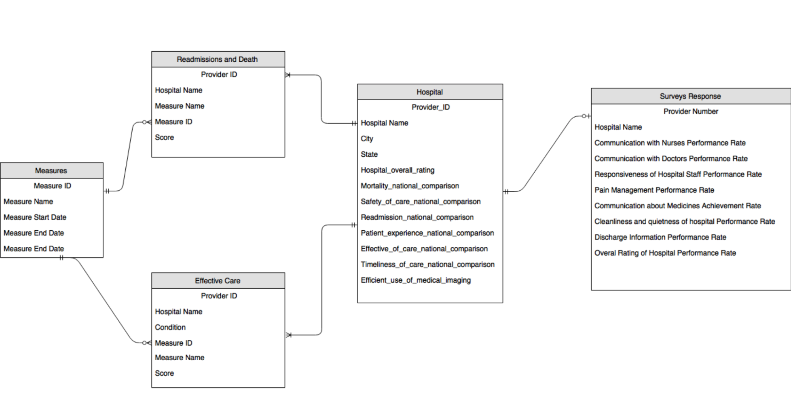

# HOSPITALS COMPARE

## 2016 MEDICARE DATA | by TED PHAM

## ANALYSIS SUMMARY

The analysis was done with HDFS and SPARK on an AWS EC2 instance, with three major tasks:

1. Loading\_and\_modeling
  - load\_data\_lake.sh retrieves flat files from data.medicare.gov
  - extracted 5 relevant files:
    1. Hospital General Information
    2. Timely and Effective Care
    3. Readmission and Deaths
    4. Survey Responses
    5. Measure Dates
  - hive\_base\_ddl.sql defines the structure for individual files
  - hospital\_ER summarizes the schema for analysis
2. Transforming
  - --SQL scripts to transform data according to the hospital ER
3. Investigations
  - Find 10 best hospitals
  - Find 10 best states as models for care
  - Find 10 hospital procedures with the highest variance
  - Find correlations between hospital ranking and patients&#39; satisfaction with various aspects of the hospital e.g. doctors, nurses, environment, staff etc

## HOSPITAL_ER Diagram




## BEST HOSPITALS

Data are used from hospitals.csv, effective_care.csv, and readmissions.csv

The hospital_rank, effective_care_rank, and readmissions_rank were

calculated respectively.


```
First, the general hospital\_general\_rank is computed by assigning scores to
the national comparison parameters: 2 for above average, 1 same, 0 not available, -1 for below.
These are done for mortality, safety\_of\_care, readmission, patient experience, effective\_of\_care,
timeliness, and efficient use of medical imaging.
The hospital\_overall\_rating score is coverted to float and zeros are assigned for
not available.
The hospital general score is computed
by assing 70% value to rating and 30% to the sum of national comparison higher is better. Then the hospital is ranked with this score and hospital\_general\_rank
is assigned.
```

```
The 2nd step is to get the effective_care_rank for each provider
For this metric, the focus is on the measure ID where lower score means better
because these are the majority the parameters from effective\_care.
```

```
The 3rd step is to get readmission specific rank
Similar to the effective care, for the readmission score lower is better.
All measure_ids are included and the readmssion_rank is computed in a similar fashion to the effective_care_rank.
```


Finally, the total rank_score is (general_rank + effective_rank*2 + readmission_rank*2)/3.
More weight is given to the hospital_general_rank (derived from hospitals.csv data).
This approach is appropriate because it considers each hospital ranking from
3 different methodologies: general info, readmission, and effective_care.
Note that the lower the rank_score the better the hospital.


The results are:

GHS PATEWOOD MEMORIAL HOSPITAL

SURGICAL HOSPITAL AT SOUTHWOODS

HOSPITAL FOR SPECIAL SURGERY

NORTHSIDE MEDICAL CENTER

NEW ENGLAND BAPTIST HOSPITAL

SOUTHEASTERN REGIONAL MEDICAL CENTER

UT SOUTHWESTERN UNIVERSITY HOSPITAL-ZALE LIPSHY


## BEST STATES
 The top 10 states are then: 

```
STATE        

SD                                                 
MT        
ID        
KS        
ND
NE        
```

## WHAT DETERMINES PATIENT PERCEPTION OF A GOOD HOSPITAL

Hospital rating (by previously described method) correlate well with patients survey rating. In particular, staff rating and hospital rating is the highest, followed by environment rating, patient rating of the hospitals, doctor rating, nurse rating, pain management, pain medicine communication,

and quality discharge.

It seems the method used to access the quality of care is well correlated with patients&#39; assessment.
```
From the correlation, it would be advised for hospitals to invest resource to staff then hospital environment.
```
